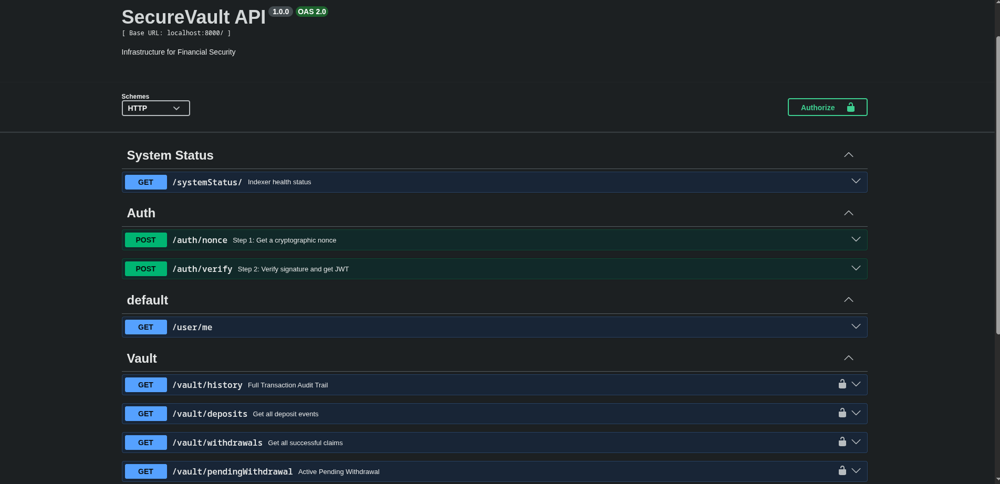
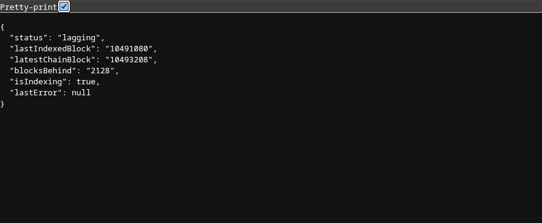

# SecureVault API

> A production-grade blockchain indexer and REST API for a time-locked Ethereum vault — built for security-first financial infrastructure.


---

## What Is SecureVault?

SecureVault is a two-part system:

1. **A Solidity smart contract** that enforces a mandatory 24-hour lock on all withdrawals — protecting users from impulsive decisions, wallet compromise, and unauthorized transfers.
2. **A backend indexer + REST API** that mirrors all on-chain activity into a queryable database in real time — so your frontend never has to wait on slow RPC calls or hit rate limits.

> **The core idea:** Rather than querying the blockchain on every API call (slow, rate-limited, unreliable), the indexer continuously mirrors contract state locally. The API then serves from the database — fast, queryable, and resilient to RPC outages.

---

## Architecture

```
┌─────────────────────────────────────────────────┐
│                  Ethereum Chain                  │
│         SecureVault.sol (Deployed Contract)      │
└──────────────────────┬──────────────────────────┘
                       │ Events (Deposit, Withdraw, etc.)
                       ▼
┌─────────────────────────────────────────────────┐
│              Polling Indexer                     │
│  • Fetches logs in batches (MAX 9 blocks/batch)  │
│  • Recovers missed blocks on restart             │
│  • Persists lastIndexedBlock to survive crashes  │
└──────────────────────┬──────────────────────────┘
                       │ Writes
                       ▼
┌─────────────────────────────────────────────────┐
│           PostgreSQL (via Prisma ORM)            │
│              VaultEvent table                    │
└──────────────────────┬──────────────────────────┘
                       │ Reads
                       ▼
┌─────────────────────────────────────────────────┐
│              REST API (Express)                  │
│   Auth → Controller → Service → Repository      │
└─────────────────────────────────────────────────┘
```

---

## Smart Contract Security

The `SecureVault.sol` contract was built with security as the primary concern:

| Pattern | Implementation |
|---|---|
| **Reentrancy Guard** | Inherits OpenZeppelin's `ReentrancyGuard` on all state-changing functions |
| **CEI Pattern** | Checks → Effects → Interactions order strictly followed to prevent reentrancy exploits |
| **Time-Lock Withdrawals** | 24-hour mandatory lock period before funds can be claimed |
| **Single Pending Withdrawal** | A user can only have one active withdrawal at a time, enforced at contract level |
| **Cancel Cooldown** | 2-hour cooldown between cancellations to prevent spam/griefing |

### Contract Events Indexed

```
UserDeposited               → Funds deposited into the vault
UserRequestedWithdrawal     → 24h lock period initiated
UserModifiedPendingWithdrawal → Lock period reset on modification
UserCancelledPendingWithdrawal → Withdrawal cancelled, funds returned
UserWithdrawn               → Funds successfully claimed after lock
```

---

## Indexer Design

The indexer is the backbone of the system. Key design decisions:

**Missed block recovery** — On every startup, the indexer reads `lastIndexedBlock` from the database and resumes from where it left off. No events are ever skipped, even across crashes or restarts.

**Batch chunking** — Logs are fetched in chunks of 9 blocks to stay within RPC provider limits and avoid timeouts on large backfills.

**Recursive polling with `setTimeout`** The next poll only starts after the current one fully completes. This prevents overlapping runs entirely.

**Block timestamp caching** — Block data is cached per indexer run so multiple events in the same block don't trigger redundant RPC calls.

---

## Authentication

SecureVault uses **wallet-based authentication** (Sign-In with Ethereum pattern):

```
1. POST /auth/nonce      → Returns a cryptographic challenge message
2. User signs with wallet (MetaMask, etc.)
3. POST /auth/verify     → Verifies signature, returns JWT
4. Use JWT as Bearer token on all protected routes
```
No passwords. No email. 

---

## API Endpoints

| Method | Endpoint | Auth | Description |
|--------|----------|------|-------------|
| `GET` | `/systemStatus` | ❌ | Indexer health & sync status |
| `POST` | `/auth/nonce` | ❌ | Get sign-in challenge message |
| `POST` | `/auth/verify` | ❌ | Verify signature, get JWT |
| `GET` | `/user/me` | ✅ | Get authenticated user profile |
| `GET` | `/vault/history` | ✅ | Full on-chain event audit trail |
| `GET` | `/vault/deposits` | ✅ | All deposit events |
| `GET` | `/vault/withdrawals` | ✅ | All successful withdrawal claims |
| `GET` | `/vault/pendingWithdrawal` | ✅ | Active pending withdrawal (if any) |
| `GET` | `/vault/totalVolume` | ✅ | Total transaction volume in ETH |

Full interactive docs available at `/api-docs` (Swagger UI).

---

## Health Endpoint

`GET /systemStatus` — no auth required:

```json
{
  "status": "healthy",
  "lastIndexedBlock": "19482031",
  "latestChainBlock": "19482035",
  "blocksBehind": "4",
  "isIndexing": false,
  "lastError": null
}
```
Status is `"lagging"` if more than 10 blocks behind.

---

## Tech Stack

| Layer | Technology |
|---|---|
| Smart Contract | Solidity ^0.8.25, OpenZeppelin |
| Runtime | Node.js, TypeScript |
| Framework | Express.js |
| ORM | Prisma |
| Database | PostgreSQL |
| Blockchain Client | viem |
| Auth | JWT + SIWE (Sign-In with Ethereum) |
| Docs | Swagger  |
| Containerization | Docker + Docker Compose |
| Testing | Vitest, Foundry tests |

---

## Running Locally

### Prerequisites
- Node.js 18+
- Docker & Docker Compose
- Foundry (for contract — `curl -L https://foundry.paradigm.xyz | bash`)
- An Ethereum RPC URL (Alchemy, Infura, or local Anvil node)

### Backend

```bash
# 1. Clone the repo
git clone https://github.com/Unique-01/SecureVault.git
cd backend

# 2. Copy environment variables
cp .env.example .env
# Open .env and fill in the values

# 3. Run the application

#### Option A — Docker (recommended)
# Starts PostgreSQL, runs migrations, and launches the app in one command
docker-compose up --build

#### Option B — Manual (for development)
# Install dependencies
npm install

# Start PostgreSQL only
docker-compose up db -d

# Run migrations
npx prisma migrate deploy

# Start the server
npm run dev
```

The API will be live at `http://localhost:8000`, 
Swagger docs at `http://localhost:8000/api-docs`

### Smart Contract

```bash
cd contracts

# Install dependencies
forge install

# Run tests
forge test

# Deploy (to local Anvil node)
anvil # in a separate terminal
```

---

## Tests

### Backend
```bash
cd backend
npm run test
```
Covers indexer event mappers, vault service logic, and auth middleware.

### Smart Contract
```bash
cd contracts
forge test -v
```
Covers deposit, withdrawal request, modification, cancellation, and claim flows with time manipulation via `vm.warp`.

---

## Project Structure

```
secure-vault/
├── contracts/                   # Solidity smart contract (Foundry)
│   ├── src/
│   │   └── SecureVault.sol      # Main vault contract
│   └── test/
│       └── SecureVault.t.sol    # Foundry tests
│
└── backend/                     # Indexer & REST API (Node.js)
    └── src/
        ├── blockchain/          # Indexer, ABI, poller, block client
        ├── modules/
        │   ├── auth/            # Wallet auth (nonce, verify, JWT)
        │   ├── user/            # User profile
        │   └── vault/           # Vault events (controller, service, repository)
        ├── middlewares/         # Auth guard
        ├── types/               # Shared TypeScript types
        ├── utils/               # JWT, nonce, message helpers
        ├── systemStatus.controller.ts  # Indexer health endpoint
        ├── server.ts            # Express server init
        └── app.ts               # Express app setup
```

---

## Screenshots

> *Swagger UI — Interactive API Documentation*



> *Health Endpoint — Live Indexer Sync Status*




---

## Key Design Decisions

**Why an indexer instead of querying the contract directly?**
Direct contract calls are slow (RPC round-trip on every request), rate-limited, and fail if your RPC provider goes down. An indexer decouples your API from the chain — the database is always available even during RPC outages.

**Why append-only event log instead of a mutable state table?**
Events are immutable facts. Storing them as-is gives you a complete audit trail for free. Current state (like pending withdrawals) is derived from the latest event — no sync complexity, no risk of state drift between two tables.

**Why wallet-based auth instead of email/password?**
This is a blockchain application — the user's identity *is* their wallet. SIWE eliminates passwords entirely and cryptographically proves ownership without any third-party dependency.


## 👨‍💻 Author

**Saheed Abdulazeez**

**Azeezsaheed2003@gmail.com**